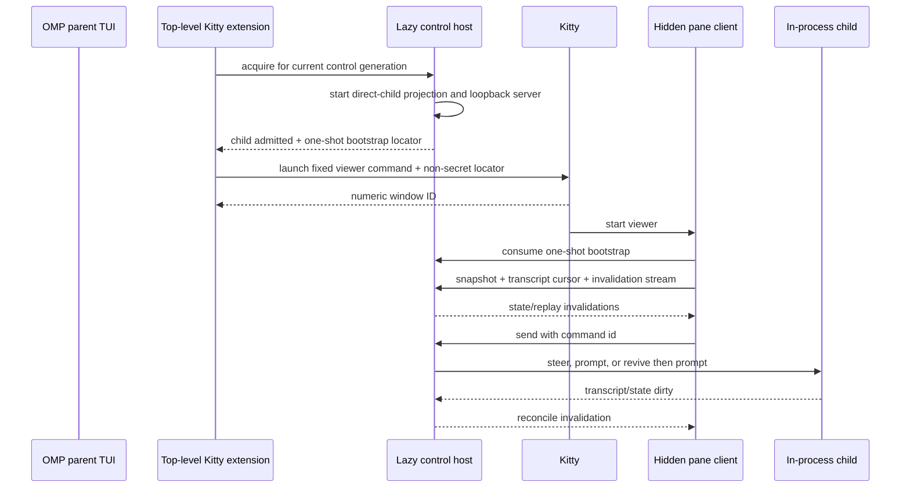

# feat: Add interactive Kitty subagent panes

## Summary

Add an optional Kitty frontend for direct OMP subagents while preserving the normal parent TUI. Each admitted child gets a terminal-native transcript pane that can continue the child with prompt/steer/revive; destructive abort/release controls remain in Agent Hub for this first vertical slice.

---

## Problem Frame

OMP supports parallel in-process subagents and an Agent Hub overlay, but individual children cannot stay visible and interactive in terminal-native panes. Kitty can supply those panes, yet OMP currently has no safe local transport that coexists with the normal TUI, preserves session ownership, and degrades without affecting agents.

---

## Assumptions

*This plan was authored in pipeline mode without synchronous confirmation. These are conservative implementation bets selected during research and headless review.*

- The normal OMP TUI must remain in the parent Kitty pane.
- The first version needs transcript/status plus prompt/steer/revive; external abort and release can remain in Agent Hub until their lifecycle semantics are hardened independently.
- Only direct children of the top-level interactive session are pane-eligible. Nested descendants continue normally and remain visible through existing Agent Hub behavior.
- The first supported distribution is the npm/Bun package used by this workstation; standalone compiled-binary extension installation is deferred.
- Same-UID processes are trusted. Browser origins, remote/SSH processes, other child panes, and unrelated Kitty windows are not trusted.

---

## Requirements

- R1. Preserve existing parent TUI, Agent Hub, IRC, history, synchronous task, asynchronous task, nested-agent, and non-Kitty behavior.
- R2. Expose current-generation direct-child availability, last task outcome, transcript replay, and prompt/steer/revive through a local authenticated transport.
- R3. Launch at most one owned Kitty pane for each admitted direct child without launching a second agent process.
- R4. Keep pane lifecycle independent from agent lifecycle: closing or losing a view never aborts, releases, or otherwise mutates the child.
- R5. Fail closed and fall back to Agent Hub when Kitty, authorization, the launcher, the sidecar, or a pane client is unavailable while the parent remains alive.
- R6. Prevent browser-origin access, cross-child capability use, SSH/remote enablement, secret disclosure through Kitty metadata, and cleanup of unrelated windows.
- R7. Ship package-level tests and documentation for enablement, security, supported states, npm/Bun installation, fallback, update, and rollback.
- R8. Apply a separate machine-local Kitty setup that provides Warp-like splits, focus navigation, prompt/output navigation, command palette, sessions, hyperlinks, and long-command notifications without making those preferences part of the upstream feature contract.

---

## Scope Boundaries

- No daemon, cross-process AgentRegistry, detached persistence, or machine-wide Agent View.
- No OMP process per Kitty pane and no tmux orchestration layer.
- No external abort, release, arbitrary approvals, editors, extension prompts, or PTY routing in the first pane client.
- No Agent Hub behavior or transcript-renderer refactor solely for pane reuse.
- No panes for nested descendants; existing nested execution and global Agent Hub visibility stay unchanged.
- No automatic Kitty installation, unrestricted `allow_remote_control yes`, fixed shared sockets, or implicit remote/SSH forwarding.
- No reusable secret in Kitty launch argv, environment metadata, title, user variables, or command line.
- Stream reconnect is limited to the same live sidecar and control generation. Parent/sidecar restart and cross-generation reconnect are unsupported.
- Parent crash ends in-process agents. Viewer panes only self-terminate after permanent endpoint/generation loss; detached recovery is out of scope.

### Deferred to Follow-Up Work

- External abort/release and linearizable release/revive hardening as a lifecycle-only change.
- Shared Agent Hub/pane transcript presentation once both consumers demonstrate stable common behavior.
- Standalone compiled-binary extension installation and embedded example distribution.
- Other terminal adapters, cross-process supervision, Python client parity, and transitive nested-agent panes.

---

## Context & Research

### Relevant Code and Patterns

- `packages/coding-agent/src/modes/components/agent-hub.ts` remains the canonical full child-control and nested-agent UI.
- `packages/coding-agent/src/registry/agent-registry.ts` and `packages/coding-agent/src/registry/agent-lifecycle.ts` provide existing prompt/revive primitives and persistent availability.
- `packages/coding-agent/src/task/executor.ts` and `packages/coding-agent/src/task/types.ts` publish direct-child lifecycle/progress/events on the invoking parent EventBus.
- `packages/coding-agent/src/modes/rpc/rpc-subagents.ts` provides complete-JSONL byte-cursor replay worth extracting without changing RPC lifecycle semantics.
- `packages/coding-agent/src/eval/py/tool-bridge.ts` provides an ephemeral loopback `Bun.serve` pattern; `packages/ai/src/auth-broker/server.ts` provides authenticated streaming and disconnect cleanup patterns.
- `packages/coding-agent/src/cli/session-picker.ts` demonstrates a standalone TUI; `packages/coding-agent/src/commands/complete.ts` demonstrates hidden command registration.
- `packages/coding-agent/test/sdk-extensions-per-session-binding.test.ts` proves child extensions are fresh instances on distinct EventBuses.

### Institutional Learnings

- Merged PR #2214 established opt-in, bounded child observation and cursor replay for external clients.
- Merged PR #994 showed that narrow external UI claims are safer than advertising general UI support.
- Closed PR #1028 exposed fragile title matching, PATH assumptions, and terminal-specific focus behavior.
- Issue #1627 confirms durable multi-session views require a daemon and are outside this feature.

### External References

- Kitty remote control and authorization: https://sw.kovidgoyal.net/kitty/remote-control/
- Kitty custom authorization: https://sw.kovidgoyal.net/kitty/remote-control/#customizing-authorization-with-your-own-program
- Kitty launch: https://sw.kovidgoyal.net/kitty/launch/
- Kitty layouts: https://sw.kovidgoyal.net/kitty/layouts/
- Kitty shell integration: https://sw.kovidgoyal.net/kitty/shell-integration/
- Kitty sessions: https://sw.kovidgoyal.net/kitty/sessions/

---

## Key Technical Decisions

- **Keep the parent TUI and use a sidecar:** stdio RPC is an alternate frontend that owns stdin and JSONL stdout. A lazy loopback sidecar is the smallest transport that can coexist with interactive mode.
- **Start nothing by default:** an in-process extension capability exists for the parent, but the projection/listener/credentials are created only after an enabled top-level extension acquires the host. Absent, disabled, child, print, RPC, non-Kitty, and SSH sessions create no listener.
- **Stamp ownership at task submission:** each top-level interactive control generation is captured when a direct task is submitted and carried through run options and lifecycle payloads. Late generation-A events cannot enter generation B.
- **Fail safely on ID collision:** a pane target is bound to control generation, stable display ID, and unique session file. Every live registry resolution must match all available identity fields; a collision rejects control instead of targeting a nested/foreign child. General registry identity redesign is deferred.
- **Keep Agent Hub unchanged:** the external authorization scope is direct-child-only; Agent Hub retains its current process-global rows and trusted in-process controls.
- **Use narrow observation events:** the sidecar emits snapshots, cursor transcript pages, and coalesced invalidations rather than raw AgentSession events. Persisted complete JSONL entries are authoritative.
- **Expose only existing safe mutations:** send resolves current state server-side—steer when running, prompt when idle, coalesced revive then prompt when parked and revivable. Parked without a reviver and terminal `aborted` are transcript-only. Abort/release stay in Agent Hub.
- **Use one permission-set capability per pane:** a token is bound server-side to one control generation, one child identity, and only snapshot/transcript/stream/send routes. It cannot access any other child.
- **Bootstrap secrets out of Kitty metadata:** launch passes only a non-secret locator. The viewer obtains endpoint/capability from an atomically created user-only one-shot handoff, which is consumed and removed. Real Kitty verification must prove `kitten @ ls` contains no active endpoint or bearer.
- **Harden loopback against browsers:** require exact Host, reject Origin/cross-site fetch metadata/OPTIONS/query credentials, omit CORS, disable caching, authenticate before body parsing, and enforce body/prompt/connection/queue/deadline limits.
- **Separate Kitty privilege:** require a custom Kitty authorization program that validates the exact packaged OMP command, launch payload, allowed variables, window type/location, ownership nonce, and close target. Action-name allowlisting alone is insufficient.
- **Own windows transactionally:** use returned numeric window IDs plus a launcher-generated per-pane nonce and expected viewer identity. Re-list and validate all three before close; titles and child IDs are display-only.
- **Bound pane admission:** default cap four, deterministic child-start order, no vacancy backfill in the same generation, manual close suppresses relaunch, and the next successful generation resets admission/suppression.

---

## High-Level Technical Design

> *Directional guidance for review, not implementation specification.*

| Availability | Pane content | Send result |
|---|---|---|
| `running` | readable transcript; running status | enqueue steer |
| `idle` | readable transcript; idle plus last outcome | start one turn |
| `parked` with reviver | readable transcript; parked | coalesced revive then start turn |
| `parked` without reviver | readable transcript; transcript-only explanation | typed non-revivable result |
| terminal `aborted` | readable transcript; terminal explanation | typed unavailable result |
| generation closed / parent lost | frozen transcript and fallback guidance | disabled; viewer exits after bounded timeout |

Pane UI has three text-labelled status fields—connection, availability/capability, last task outcome—and never relies on color alone. Prompt editing is the default mode; an explicit transcript-navigation mode owns scroll keys; reconnect/terminal states disable mutations and preserve the draft. Each mutation carries a generation-scoped command ID and is at-most-once; a lost acknowledgement becomes `outcome unknown` and is never retried automatically.

---

## Implementation Units

### U1. Add minimal current-generation child control

**Goal:** Provide direct-child prompt/steer/revive without changing Agent Hub or destructive lifecycle semantics.

**Requirements:** R1, R2, R4

**Dependencies:** None

**Files:**
- Create: `packages/coding-agent/src/agent-control/control.ts`
- Modify: `packages/coding-agent/src/task/types.ts`
- Modify: `packages/coding-agent/src/task/index.ts`
- Modify: `packages/coding-agent/src/task/executor.ts`
- Test: `packages/coding-agent/test/agent-control.test.ts`
- Test: `packages/coding-agent/test/tools/task.test.ts`
- Test: `packages/coding-agent/test/tools/irc.test.ts`

**Approach:**
- Capture an immutable control-generation token at direct task submission and carry it through lifecycle/progress/event payloads.
- Bind targets to generation, stable ID, and session file; verify registry resolution still refers to that target before every mutation.
- Implement send only: steer running, prompt idle, ensure-live then prompt parked-revivable, reject parked-nonrevivable/terminal/foreign/unknown.
- Preserve Agent Hub global controls, IRC wake/revive, async result settlement, and history access.

**Test scenarios:**
- Running, idle, and parked-revivable send paths produce exactly one intended turn; two parked sends coalesce revival.
- Parked-nonrevivable, terminal-aborted, unknown, nested, stale-generation, and identity-mismatch targets return typed errors without creating sessions.
- A generation-A async child starting/finishing after a generation-B switch is never admitted or controlled by B; a reused stable ID plus different session file is rejected.
- Async task result settles exactly as before; a later pane prompt does not rewrite the settled result.
- Existing Agent Hub nested visibility/control, IRC messaging/revival, and history access remain unchanged.

**Verification:**
- External send never resolves a child using display ID alone and cannot cross generation/session-file boundaries.
- No existing destructive lifecycle or Agent Hub behavior changes.

### U2. Build the lazy authenticated projection and sidecar

**Goal:** Expose direct-child state, transcript replay, invalidations, and send through a bounded same-host protocol.

**Requirements:** R1, R2, R4, R5, R6

**Dependencies:** U1

**Files:**
- Create: `packages/coding-agent/src/agent-control/projection.ts`
- Create: `packages/coding-agent/src/agent-control/transcript.ts`
- Create: `packages/coding-agent/src/agent-control/protocol.ts`
- Create: `packages/coding-agent/src/agent-control/server.ts`
- Modify: `packages/coding-agent/src/modes/rpc/rpc-subagents.ts`
- Modify: `packages/coding-agent/src/main.ts`
- Modify: `packages/coding-agent/src/session/agent-session.ts`
- Modify: `packages/coding-agent/src/extensibility/extensions/types.ts`
- Test: `packages/coding-agent/test/agent-control-server.test.ts`
- Test: `packages/coding-agent/test/rpc-subagents.test.ts`
- Test: `packages/coding-agent/test/sdk-extensions-per-session-binding.test.ts`

**Approach:**
- Extract complete-entry byte-cursor replay without changing current RPC snapshot lifecycle. Limit reset semantics to cursor-beyond-EOF unless the implementation adds a stronger file identity.
- Add one post-commit session-generation observer covering every successful new/switch/branch/tree mutation and never cancellation/rollback.
- Expose a top-level EventBus-bound extension capability. Acquiring it lazily starts projection/server; child EventBuses and non-interactive modes cannot acquire it.
- Define versioned snapshot/transcript/invalidation/send DTOs. Use generation-scoped command IDs and a bounded deduplication ledger for at-most-once mutation acknowledgement.
- Enforce browser-resistant request validation, per-pane permission-set capabilities, connection/body/prompt/queue/deadline limits, and redaction.
- Revoke old-generation streams/capabilities before publishing the new generation. A terminal invalidation is best-effort; command rejection is authoritative.

**Test scenarios:**
- No extension acquisition means no listener, credential, projection, or transport subscription.
- Parent extension can acquire; child/print/RPC extension contexts cannot; teardown unbinds it.
- Authorized pane receives only its child snapshot/transcript/invalidation/send; pane A cannot access pane B.
- Wrong Host, hostile Origin, cross-site metadata, OPTIONS, query token, unauthenticated stream, invalid body, oversized prompt, connection flood, and command flood fail without stalling parent progress.
- Same-generation stream loss catches up from persisted cursor; partial trailing JSONL does not advance; cursor beyond EOF resets.
- Successful session mutation revokes old clients and ignores late events; cancelled mutation preserves them; extension-triggered mutations follow the same observer.
- Accepted send with lost response and repeated command ID returns the original typed result without executing twice.

**Verification:**
- The normal TUI remains responsive under rejected and saturated view traffic.
- A stale, browser-origin, child-crossing, or wrong-generation client cannot observe or mutate agents.

### U3. Build the packaged pane client

**Goal:** Render one child in a Kitty pane and continue it interactively through the sidecar.

**Requirements:** R2, R3, R4, R5, R7

**Dependencies:** U2

**Files:**
- Create: `packages/coding-agent/src/commands/agent-pane.ts`
- Modify: `packages/coding-agent/src/cli-commands.ts`
- Test: `packages/coding-agent/test/agent-pane.test.ts`
- Test: `packages/coding-agent/test/cli/completions.test.ts`
- Test: `packages/coding-agent/test/smoke.test.ts`

**Approach:**
- Register a hidden command included in the npm/Bun package; it takes only a non-secret bootstrap locator and child selector.
- Consume and unlink the one-shot handoff before opening the long-lived stream. Never place endpoint/capability in argv or environment.
- Render a deliberately narrow sanitized transcript/status UI rather than refactor Agent Hub.
- Define prompt-editing and transcript-navigation modes, visible footer hints, submit/newline/paste semantics, escape/Ctrl-C behavior, scroll anchoring, resize behavior, and non-color status labels.
- Freeze transcript and disable mutation during reconnect, capability revocation, generation close, protocol mismatch, outcome-unknown, or parent loss. Exit after a bounded permanent-loss timeout without mutating the child.

**Test scenarios:**
- Representative `running`, `idle`, `parked-revivable`, parked-transcript-only, failed-plus-idle, terminal-aborted, reconnecting, generation-closed, and parent-lost combinations render distinct text labels and legal actions.
- Prompt mode and transcript mode keys do not conflict; live output follows only when already at bottom, otherwise preserves an entry anchor and shows new-output text.
- Missing/consumed/permission-invalid handoff, unauthorized response, malformed frame, and permanent endpoint loss render bounded sanitized errors and exit predictably.
- Closing the pane sends no agent mutation; outcome-unknown never auto-retries.
- Hidden command ships in npm/Bun package output and stays absent from normal help/completions.

**Verification:**
- The pane can observe and continue its assigned child without a second agent process and without requiring Agent Hub changes.

### U4. Add the opt-in Kitty launcher extension and authorization policy

**Goal:** Create and clean up only verified OMP viewer panes while confining Kitty privilege to the launcher.

**Requirements:** R3, R4, R5, R6, R7

**Dependencies:** U2, U3

**Files:**
- Create: `packages/coding-agent/examples/extensions/kitty-subagent-panes.ts`
- Create: `packages/coding-agent/examples/kitty/authorize-omp-panes.py`
- Modify: `packages/coding-agent/package.json`
- Modify: `packages/coding-agent/src/index.ts`
- Test: `packages/coding-agent/test/kitty-subagent-panes.test.ts`

**Approach:**
- Enable only for the top-level interactive extension, same-host non-SSH Kitty, and an explicit local opt-in.
- Admit children in start order to a default cap of four; no same-generation backfill; manual close suppresses relaunch until the next generation.
- Resolve constant npm/Bun OMP and `kitten` executables. Launch with argv arrays, `--type=window`, `--keep-focus`, no shell, no copy-env/allow-remote-control/no-response, a non-secret one-shot locator, and a generated per-pane ownership nonce.
- Require a custom Kitty authorization program that validates exact launch/close payloads and rejects arbitrary commands, extra environment, alternate targets/types, broad matches, and unrelated windows.
- Treat launch as a transaction. Capture returned numeric ID; on lost response or concurrent shutdown reconcile by ID, nonce, and expected viewer identity. Revalidate all three before close.
- Never log raw `kitten @ ls`; inspect/sanitize structured output. Viewer self-exit handles parent crash; graceful shutdown closes verified panes.

**Test scenarios:**
- Duplicate rapid starts create one pane per admitted child up to four; overflow/manual close/launch failure do not backfill; next generation resets admission.
- Option-like, quoted, newline, regex, Unicode, and control-character child labels cannot alter argv, ownership, matching, title, or close target.
- Non-Kitty, SSH, denied authorization, missing executable, malformed response, launch failure, and Kitty exit emit one bounded notice and never affect sync/async agents.
- Authorization denies arbitrary executable, extra env, remote-control grant, alternate target/type, broad close match, and unrelated-window close using the same password.
- Real Kitty metadata contains no active endpoint/capability; viewer has no Kitty-control variables or authority.
- Lost response, switch during launch, stale numeric ID, manual close before response, duplicate cleanup, graceful exit, and forced parent termination never close unrelated windows or leave a viewer beyond timeout.

**Verification:**
- With the extension absent or disabled, OMP opens no listener and allocates no view transport.
- Every close is preceded by exact ID + nonce + viewer-identity validation.

### U5. Document setup and run focused acceptance

**Goal:** Make the npm/Bun integration installable, secure, reversible, and testable on macOS Kitty 0.47.2.

**Requirements:** R5, R7, R8

**Dependencies:** U1, U2, U3, U4

**Files:**
- Create: `docs/kitty-subagent-panes.md`
- Modify: `docs/tools/task.md`
- Modify: `packages/coding-agent/README.md`
- Modify: `packages/coding-agent/CHANGELOG.md`

**Approach:**
- Document explicit opt-in, custom authorization, npm/Bun extension installation, security boundary, four-pane policy, direct-child scope, same-generation reconnect, Agent Hub fallback, troubleshooting, update, uninstall, and rollback.
- Keep the broader Warp-like Kitty preferences in a clearly optional machine-local example section, separate from feature prerequisites.
- Run one packaged-install smoke flow plus focused real-Kitty security/ownership checks after automated tests pass.

**Test scenarios:**
- Documentation can be followed from a clean npm/Bun install without source-tree assumptions.
- Setup is idempotent; uninstall removes extension, custom authorization, one-shot artifacts, and secrets while preserving unrelated Kitty configuration.
- Two direct children produce two panes while parent TUI remains responsive; pane text reaches only its child; async settlement remains unchanged; a nested grandchild creates no pane but remains in Agent Hub.
- Denied control and non-Kitty launch produce one notice and Agent Hub-only fallback.
- `kitten @ ls`, process argv, logs, and debug output contain no active endpoint/capability; viewer cannot invoke Kitty control.
- Graceful exit closes verified panes; forced parent loss causes viewer self-exit without touching unrelated windows.
- Optional Warp-like shortcuts validate side-by-side/stacked splits, focus, prompt/output navigation, palette, sessions, hyperlinks, and long-command notification.

**Verification:**
- Automated package tests pass, focused real-Kitty acceptance passes, and restoring the pre-change local config returns normal OMP/Kitty behavior.

---

## System-Wide Impact

- **Interaction graph:** top-level extension acquisition lazily creates one control generation, direct-child projection, sidecar, and per-pane capabilities; Kitty owns terminal windows; children remain in-process.
- **Error propagation:** typed send/view errors return to one pane; view failure exits/degrades the pane only; Agent Hub remains the full fallback.
- **State lifecycle:** task generation stamping prevents late-event admission; session-file matching fails safe on registry collisions; command IDs prevent duplicate sends; generation close revokes all pane capabilities.
- **API parity:** stdio RPC and Agent Hub remain behaviorally unchanged. The new extension capability is top-level-only and does not advertise general UI support.
- **Integration coverage:** automated tests cover transport, projection, client, and launcher contracts; a focused Kitty run covers real authorization, metadata, window identity, GUI PATH, and cleanup.
- **Unchanged invariants:** sync/async/nested agents, IRC, history, and non-Kitty operation continue without view allocation when the feature is disabled.

---

## Risks & Dependencies

| Risk | Mitigation |
|---|---|
| Late old-session events enter a new view generation | Stamp generation at task submission and filter every projection event |
| Stable ID collision targets a nested/foreign child | Bind generation + stable ID + session file and reject mismatches |
| Loopback is reached by a browser or saturated client | Host/Origin/fetch checks, no CORS, cheap auth first, strict size/count/deadline bounds |
| Capability leaks through Kitty metadata | One-shot user-only handoff; no reusable secret in argv/env/title/vars; real `kitten @ ls` assertion |
| Kitty password grants arbitrary launch/close | Custom authorization validates exact payload and owned close target |
| View failure affects the parent event loop | Lazy start, bounded queues/requests, typed shutdown, saturation tests |
| Lost send acknowledgement duplicates a turn | Generation-scoped command ID and at-most-once result ledger |
| Cleanup closes a user window | Numeric ID + per-pane nonce + expected viewer identity revalidated before close |
| Kitty GUI PATH differs from shell launch | Resolve installed npm/Bun OMP and Kitty executables explicitly; test GUI launch |

---

## Documentation / Operational Notes

- The broader Warp-like Kitty setup is user preference, not an OMP support prerequisite.
- Do not forward Kitty control, sidecar bootstrap locators, or capabilities over SSH.
- Do not log raw Kitty window listings or request headers.
- The sidecar must use the central logger only and never write protocol bytes to TUI stdout.

---

## Sources & References

- Related code: `packages/coding-agent/src/modes/components/agent-hub.ts`
- Related code: `packages/coding-agent/src/modes/rpc/rpc-subagents.ts`
- Related code: `packages/coding-agent/src/registry/agent-lifecycle.ts`
- Related code: `packages/coding-agent/src/eval/py/tool-bridge.ts`
- Related issue: https://github.com/can1357/oh-my-pi/issues/1627
- Related merged PR: https://github.com/can1357/oh-my-pi/pull/2214
- Related merged PR: https://github.com/can1357/oh-my-pi/pull/994
- Related closed PR: https://github.com/can1357/oh-my-pi/pull/1028
- Kitty remote control: https://sw.kovidgoyal.net/kitty/remote-control/
- Kitty launch: https://sw.kovidgoyal.net/kitty/launch/
